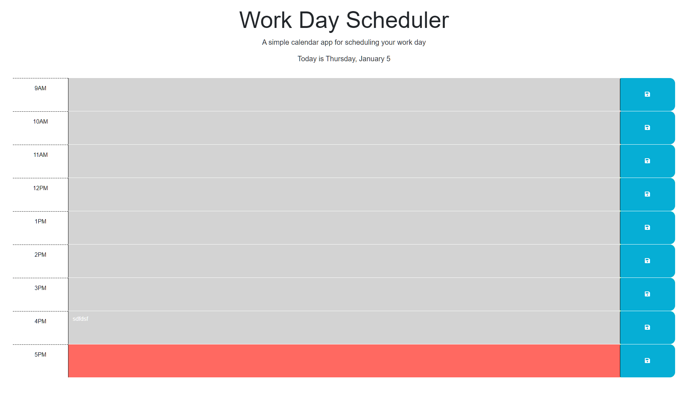

# Daily Planner

## What is this project?
This project is an agenda that uses the current hour of the day to map out what time block the user is currently in. 

### Objectives Targeted
* When the client:  
  * opens the planner the current day is displayed at the top of the calender.
  * scrolls down, they are presented with time block for standard business hours.
  * views the time blocks for that day, each time block is color-coded to indicate whether it is in the past, present, or future.
  * clicks into a time block, they can enter an event.
  * clicks the save button for that time block, the text for that event is saved in local storage.
  * refreshed the page, the saved events persist.

The following is a link to the GitPages site: [Work Day Schedule](https://kenny4297.github.io/Daily-Planner/)

The following is a screen shot of the final product: 

